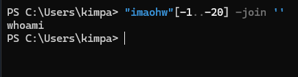

## Detection
To inject an additional command to the intended one, we may use any of the following operators:

| Injection Operator | Injection Character | URL-Encoded Character | Executed Command                                    |
|--------------------|---------------------|-----------------------|-----------------------------------------------------|
| Semicolon          | ;                   | %3b                   | Both                                                |
| New Line           | \n                  | %0a                   | Both                                                |
| Background         | &                   | %26                   | Both (second output generally shown first)          |
| Pipe               | \|                   | %7c                   | Both (only second output is shown)                  |
| AND                | &&                  | %26%26                | Both (only if first succeeds)                       |
| OR                 | \|\|                  | %7c%7c                | Second (only if first fails)                        |
| Sub-Shell          | ``                  | %60%60                | Both (Linux-only)                                   |
| Sub-Shell          | $( )                | %24%28%29             | Both (Linux-only)                                   |


We can use any of these operators to inject another command so both or either of the commands get executed. We would write our expected input (e.g., an IP), then use any of the above operators, and then write our new command.

> Tip: In addition to the above, there are a few unix-only operators, that would work on Linux and macOS, but would not work on Windows, such as wrapping our injected command with double backticks (``) or with a sub-shell operator ($()).

In general, for basic command injection, `all` of these operators can be used for command injections `regardless of the web application language, framework, or back-end server.` For example, if we are injecting in a `PHP` web application running on a Linux server, or a `.Net` web application running on a `Windows` back-end server, or a `NodeJS` web application running on a `macOS` back-end server, the listed injections should work regardless. 
> Note: The only exception may be the `;` semi-colon, which will not work if the command was being executed with `Windows Command Line (CMD)`, but would still work if it was being executed with `Windows PowerShell`. 

## Injecting Commands

Lets say we come across a web application that allows the user to input a valid IP address so that the web application can check if the IP address is "active". When a malicious actor uses one of the above `injection operators` like `;`, the web application may request that the user inputs a valid formatted string, or IP address in this case. If you append `;whoami` to a valid IP address, the web application could still give you an error stating to match the requested format. 
> TIP: it's important to check if the web application is sending the `payload` to the backend. You can check this by going to the browser's `developer tools` -> `network` and resend the payload like `127.0.0.1;whoami` again. If there are no network requests made when you clicked on the `submit` or `check` button, and still got an error message... this indicates the `user input validation is happening on the front-end`

> Interesting Note: It's very common for developers only to perform input validation on the front-end while not validating or santizing the input on the back-end.

### Bypassing Front-End Validation 

`Frontend validation checks` typically ensures that the user input matches a certain expected format before being sent to the backend, such as checking for a `valid IP address` or `rejecting special characters`. However, this `validation is usually only applied in the browser`. 
> You can use a web proxy like `Burp Suite` to intercept the HTTP request before it reaches the backend.

Since `frontend validation` happens on the client side (`in the browser`), it can be bypassed by `manually editing the request that is being sent to the server`. A malicous actor can modify the intercepted request to inject commands (`e.g. 127.0.0.1; whoami`), `URL-encode` the payload, and then the send it to the server directly. 

## Filters/Web Application Firewall (WAF) Bypass Techniques 

### Filter/WAF Detection 
To build on the example of the `ping` web application, there's a scenario of what if the web application developers added `filters` and/or `WAFs`? If we inject malicious characters like (`;, &&, ||`), the web application may take our injection and print out a string like: `Invalid Input`. This indicates that something we sent triggered a security mechanism in place that denied our request. This error message can be displayed in various ways. If the web application displays the `error message` where the `output` is displayed, it could indicate that it was detected and prevented by the `PHP` web application itself. 
> If the error message displayed a different page, with information like our `IP` and our `request`, this may indicate it was denied by a WAF

Let's create a scenario: let's say the web application that takes user input like an `IP address` checks to see if the user input is valid. For instance, when we inject a payload like: `127.0.0.1; whoami` it could give us an `invalid input` error message. But how do we know which special character or word is blacklisted? If we had the source code, we could tell, however because we don't we can simply test it by slowly appending special characters like `;, ||, &&` to valid input like `127.0.0.1` until we see `Invalid Input`. 

### Bypass Blacklisted Operators
Building on what was stated in the previous section, to bypass blacklisted operators like `;, ||, &&` we can simply fuzz the web application and make note of which operators are blacklisted, and simply use an operator that isn't blacklisted like `\n -> %0a`. 
> We would test if \n (url encoded: `%0a`) is blacklisted by appending only the new-line character operator to a valid input like `127.0.0.1` and see if we run into any errors. If we don't we now know that the new-line character operator is not blacklisted.

### Bypass Blacklisted Spaces
Now that we know that `\n` is not blacklisted, we can try to test a payload like: `127.0.0.1%0a+whoami`. 
> Note that `+` is the url encoded version of a `space` character.

We could still run into an `Invalid Input` error. To get around this we can use `tabs` (`%09`) instead of spaces, as both `Linux` and `Windows` accept commands with tabs between arguments, and they are executed the same. So, we can try to change our payload to something like: `127.0.0.1%0a%09whoami`  

Another technique we can try is utilizing the Linux Environment Variable which is encoded as `${IFS}`. The default value of this variable is a `space` and a `tab` so we can use this variable where the spaces should be like: `127.0.0.1%0a${IFS}whoami`  

We can also try utilizing `brace expansion`, specifically `Bash Brace Expansion` feature, which automatically adds spaces between arguements wrapped between braces. For instance, `{ls,-la}`. So our payload from before would look something like: `127.0.0.1%0a{whoami}`

### Bypassing Other Blacklisted Characters
A very common blacklisted character is the slash `/` and/or the blackslash `\`, because they are necessary to specify directories in `Linux` and `Windows`. So how can we bypass this? 

#### Linux
While the environment variable `${IFS}` is directly replaced with a space, we can use the same concept of having a `Linux Environment Variable` replacing slashes or semi-colons. Unfortunately, there's no such environment variable for slashes or semi-colons. However, these characters may be used in an `environment variable`, and we can specify the `start` and `length` of our string to exactly match this character. 
> Environment variables in Linux are like notes taht the computer keeps to remember important things, like where to find certain programs or how to behave when running them. For example, `PATH` tells the computer where to look for programs when you type a command: `/usr/bin:/bin:/usr/local/bin`

> Both `$PATH` and `${PATH}` are acceptable! However with `{}` we can specify the `start` and `length`. For example: `${PATH:0:1}` would start at character `0` and only take a string length of `1`

> TIP: You can list all Linux environment variables using the `env` or `printenv` command. You can also use the `set` command to list all variables, including local variables. Also, after the `[env-name]=` you start from 0 when you count the characters. Then you can pinpoint which character `like ;` you want and set the length to `1`. For example: `${LS_COLORS:10:1}` would output `;`!

Knowing all of this, we can now bypass `/` and even `;` filters by setting out payload to be like: `127.0.0.1${LS_COLORS:10:1}${IFS}`

#### Windows
The same concept works on Windows as well. For example, to produce a `slash` in `Windows Command Line (CMD)`, we can `echo` a Windows variable (`%HOMEPATH%`-> `\Users\example`), and then specify the `starting position` and the `negative end position`. For example if `%HOMEPATH%`-> `\Users\example`, I can extract `\` by specifying that the starting position is `6` which results in `\example` and that the negative ending position is `-7`, which lands before the `\`. The slicing ends up isolating the `\` before `example`. So the result would be: `%HOMEPATH:~6,-7%`
> If this doesn't work, you can try the syntax of `%VARIABLE_NAME:~START,LENGTH%`. Remember that when determining the start index character, it is `zero-based`.

We can achieve the same thing using the variables in `Windows Powershell`. With PowerShell, a word is considered an array, so we have to specify the index of the character we need. As we only need on character, we don't have to specify the `start` and `end` positions: `$env:HOMEPATH[0]`

#### Character Shifting
There are other techniques to produce the required characters without using them, like `shifting characters`. To understand this, you should bring up an ascii table. You can do this by looking online or simply typing `man ascii` in your Linux system's terminal. For the sake of an example, you can see that `\` has the ascii value of `92`, and `[` has the ascii value of `91`. In Linux, the `tr` command can change characters based on a pattern. You can use this knowledge and create the following command: `echo $(tr '!-}' '"-~'<<<[)`

Let’s break this down into two parts and explain each clearly:

##### Part 1: The `$()` in the Command
The `$()` is a **command substitution** syntax in Linux.

- It allows you to **run a command** and use the **output of that command** inside another command.
- In simple terms, whatever is inside `$()` will be run first, and the result will be inserted into the larger command.

For example:
```bash
echo $(date)
```
This runs `date` (which prints the current date and time), and `echo` will print the result of `date`.

In your case:
```bash
echo $(tr '!-}' '"-~' <<< [)
```
- The `tr` command inside `$()` is executed first.
- The result of that command is then passed to `echo` to be printed.

##### Part 2: The `tr '!-}' '"-~'` Command

The `tr` command is used to **translate** or **replace** characters.

- `'!-}'` is a **range of characters** from `!` (ASCII 33) to `}` (ASCII 125).
- The part `'"-~'` tells `tr` to **map** those characters to another range, which starts at `"` (ASCII 34) and ends at `~` (ASCII 126).

##### What does `tr '!-}' '"-~'` do?

- This **shifts** each character from `!` to `}` **up by 1** in the ASCII table.
  - `!` (ASCII 33) becomes `"`.
  - `"` (ASCII 34) becomes `#`.
  - And so on...

##### The Important Part: Using `<<< [`

- `<<< [`: This sends the character `[` (ASCII 91) to `tr`.
- The `tr` command **shifts** it by 1.
  - Since `[` has an ASCII value of **91**, when we shift it by 1, it turns into `\`, which has an ASCII value of **92**.

##### Final Command Breakdown
```bash
echo $(tr '!-}' '"-~' <<< [)
```
1. `<<< [` sends the character `[` to `tr`.
2. `tr '!-}' '"-~'` shifts the character `[` by 1 in the ASCII table, turning it into `\`.
3. `echo` then prints the result, which is `\`.

###### Summary:
- The `$()` runs the `tr` command and uses its output.
- The `tr` command shifts characters, and `<<< [` gives the starting character (`[`).
- This trick is a clever way to get the `\` character without directly typing it.

> NOTE: this would not work if `[` (`ascii value 92`) was not within the range of the sets of characters to translate!

### Bypass Blacklisted Commands

With the same logic of web applications being able to blacklist certain operators like `;` and `spaces`, they can also blacklist `commands` such as `whoami`. For instance, `ip=127.0.0.1%0a` would not trigger an error but `ip=127.0.0.1%0awhoami` could. 

#### Linux and Windows 
One very common and easy obfuscation technique is inserting certain characters within the command (`whoami`) that are usually ignored by command shells like `Bash` or `Powershell` and will execute the same command as if they were not there. Some of the characters are a single quote `'` and a double quote `"`. 

For example, if we want to obfuscate the `whoami` command, you can insert single or double quotes between its characters as follows: `w'h'o'am'i` or `w"h"o"am"i`
> TIP: You cannot mix the `type of quotes` and `the number of quotes must be even`

#### Linux Only 
In Linux, you can utilize the backslash `\` and the positional parameter `$@` the same way as we did to obsfucate the command names with quotes: `who$@ami` or `w\ho\am\i`
> TIP: The number of characters `do not have to be even`, and we can insert just one of them if we want to

#### Windows Only 
There are some characters that we can use in Windows-only to insert in the middle of commands that do not affect the outcome. One of the more notable ones is the caret `^` character: `who^ami`

### Advanced Command Obfuscation
In some instances, the web application may employ advanced filtering solutions, like Web Application Firewalls (WAFs), and basic evasion techniques may not necessarily work. However, on the flip side, we can utilize more advanced techniques for such occasions. 

#### Case Manipulation 
One command obfuscation technique we can use is `case manipulation`, like inverting the character cases of a command like `WHOAMI` or `WhOaMi`. This can work because a command blacklist may not check for `different case variations` of a single word, as Linux systems are `case-sensitive`. 
> TIP: If you're dealing with a Windows server, you can change the casing of the characters and send it. In Windows, commands for Powershell and CMD are `case-insensitive`, meaning they will execute the command regardless of what case it is written in: `WHOamI`

When it comes to Linux and a bash shell, which are `case-sensitive`, you must employ creative techniques and find a command that turns the target command into an all-lowercase word. 
* `$(tr "[A-Z]" "[a-z]"<<<"WhOaMi")`
* `$(a="WhOaMi";printf %s "${a,,}")`
  * This sets a variable `a` to the string `"WhOaMi"`
  * `printf` in Bash  formats and outputs data
  * `%s` is a `format specifier` in printf. It tells printf to treat the corresponding input as a string
  * `${...}` is `parameter expansion`. It allows for more advanced operations on variables, like modifying, transforming or extracting parts of their values
  * `,,` is `case modification operator` within the `parameter expansion`.
    * `,,` converts all uppercase letters in the variable's value to lower case
    * `${a,,}` takes the string stored in `a` and coverts it to `"whoami"`
  
#### Reversed Commands
Another command obfuscation technique that can be employed is `reversing commands` and having a `command template` that switches them back and executes them in real-time. For example, we can write `imaohw` instead of `whoami` to avoid triggering the blacklisted command. 
* `echo 'whoami' | rev`
* `$(rev<<<'imaohw')`
> NOTE: `<<<` is a `here string` in bash. It sends a single string to the standard input of a command. `|` takes the `output of one command` and sends it to the `stdin` of another

The same can be done in Windows:  



